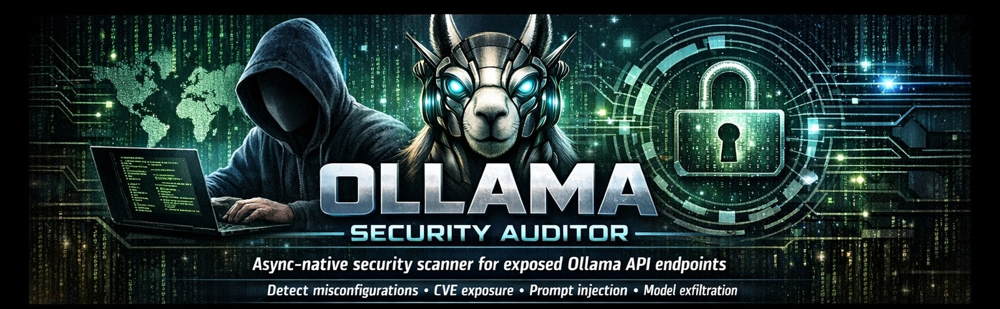

<div align="center">
  
# 🛡️ Ollama Security Auditor v1.5.0

> *A fast, async-native security testing framework for exposed Ollama API instances, CVE vulenrabilities and advanced probes.*

[](https://python.org)
[](https://docs.python.org/3/library/asyncio.html)
[](https://github.com/YogSotho)

## 🔍 Overview
**Ollama Security Auditor** is a professional-grade toolkit designed for security researchers, pentesters, and DevOps engineers. It identifies misconfigurations, known CVEs, and exposure risks in locally hosted or publicly accessible Ollama API endpoints (default port 11434).

## ⚡ Key Features
*   **🌐 Dynamic Threat Intel**: Auto-fetches live advisories from GitHub Security, NVD, and ExploitDB.
*   **🌍 Single Target/IP Range Support**: scans a single IP/url or a range of IP addresses.
*   **📊 Rich Reporting**: Generates structured **Markdown** and **JSON** reports with severity sorting, evidence blocks, and CVSS context.
*   **🔒 Advanced Probes**: Detects model weight exfiltration, Modelfile RCE, Prompt Injection, Cloud Metadata SSRF, and Token brute-force vulnerabilities.
*   **🤖 Model Retrieving**: retrieves every LLM model present on the server.
*   **🛑 WAF & Rate Limit Aware**: Automatically detects protection layers and throttles requests to avoid IP bans.
*   **⚙️ Safe & Deep Modes**: `STANDARD` for read-only recon, `--deep` for semi-intrusive validation.

## 🚀 Quick Start

### Prerequisites
```bash
pip install aiohttp
```

### Basic Usage
```bash
# Target IP or Host
python Ollama_Security_Auditor_v1.5.0.py http://192.168.1.100:11434
```

### Advanced Usage
```bash
# Deep scan with JSON output and custom delay
python Ollama_Security_Auditor_v1.5.0.py http://target:11434 \
  --output my_audit \
  --format json \
  --deep \
  --delay 0.5
```

## 📁 Output Example
The tool automatically saves timestamped reports to your current directory:
```
✅ Report saved to: my_audit_audit_2024-04-09_143210.md
```
*Reports include target profiling, vulnerability matrices, CVE evidence, and actionable remediation steps ready for SIEM ingestion or executive review.*

## ⚠️ Legal Disclaimer
This tool is intended **exclusively for authorized security testing**. Scanning networks, APIs, or services you do not own or have explicit written permission to test is illegal. Always operate within the bounds of responsible disclosure and local regulations.

---

## 👤 Author & Connect

**Yog-Sotho**  
🔗 [**Linktree**](https://linktr.ee/YogSotho) | 🛡️ Security Lover | 🤖 AI & LLM Enthusiast

> *"I like crypto. I like security. I like computers. I like good food. I love AI and LLM modules. I fight scammers in my free time."*

---
*Use responsibly. Stay curious. Secure everything.* 🔒
```
